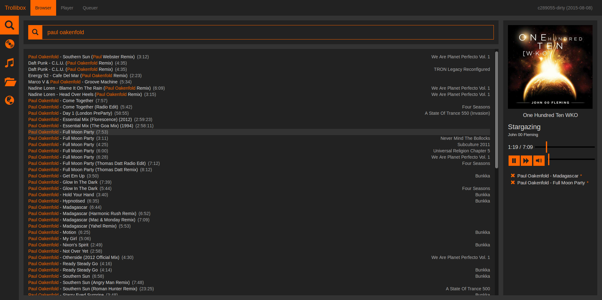
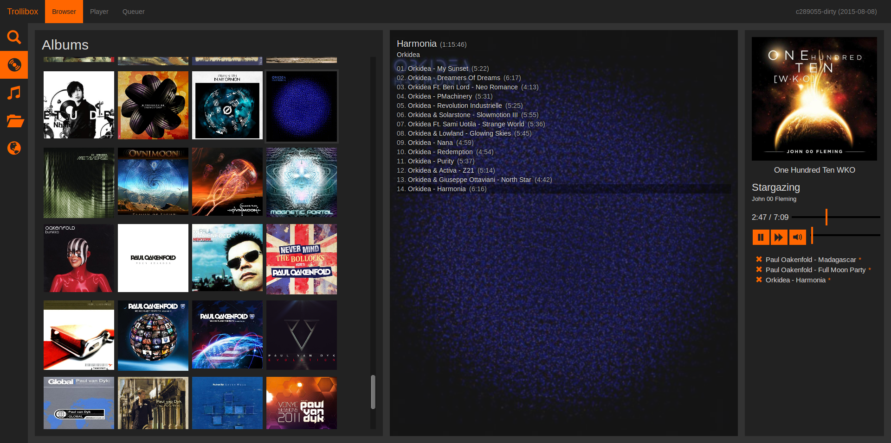
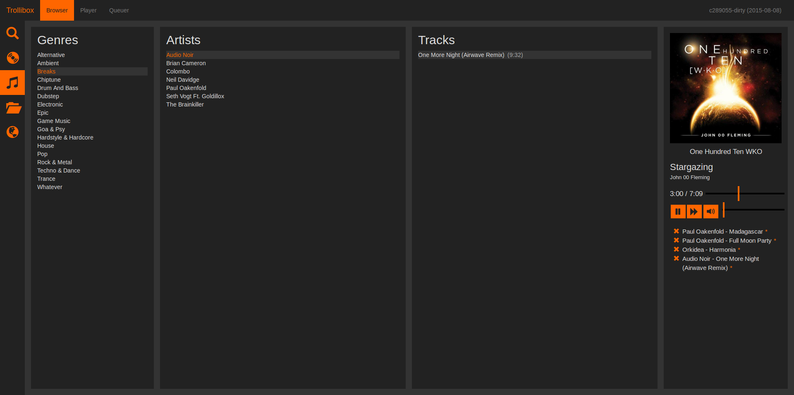
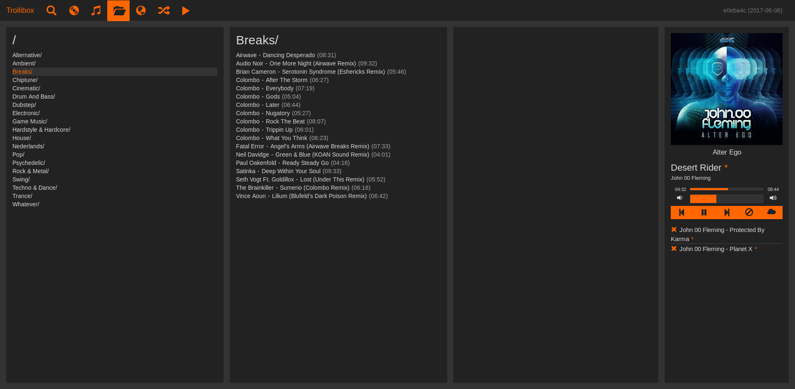
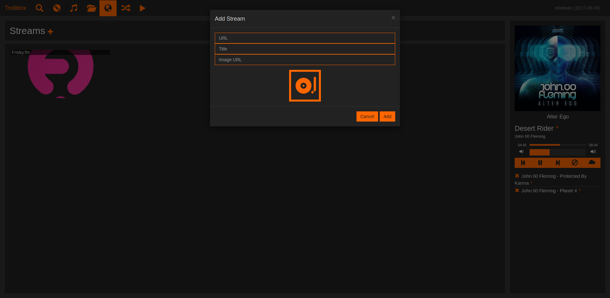
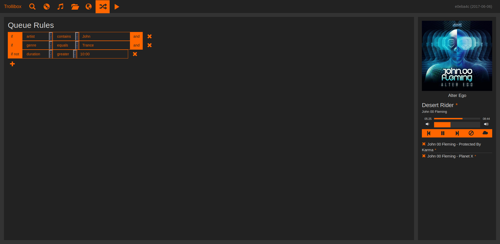

Trollibox
=========

The hackerspace friendly ~~MPD~~ music player web client.

License: GPLv3.

## Installing

We're not using semantic versioning yet, but it is safe to install from the
master branch.

### Building
Clone the repository into your [$GOPATH](https://www.youtube.com/watch?v=XCsL89YtqCs).

The following tools are required to build Trollibox:
* Golang
* [go-bindata](https://github.com/jteeuwen/go-bindata)
* NPM

Once you got that sorted out, its time to build trollibox. Build it by simply running:
```sh
RELEASE=1 ./just build
```
That will produce the trollibox containing all of its assets.

### Configuring

Copy the [example configuration](config.example.json) to config.json, its
default location. If you want to use a custom location for the config file, you
should inform trollibox by using the `-conf` option. Like this:
```sh
trollibox -conf /etc/trollibox.json
```

Inside the configuration file, you will find some options you should may need
to change:
```js
{
  // The network address to listen on. Must be in the Go listen format.
  // For example:
  //  ":80" // Listen on port 80 on all interfaces.
  "listen-address": "127.0.0.1:3000",

  // The base URL at which the webinterface will can be reached by clients.
  // Must end with '/'.
  "url-root":       "http://localhost:3000/",

  // The directory which Trollibox will use to store data which can not be
  // saved to MPD.
  "storage-dir": "~/.config/trollibox",

  // The sections below list options to configure the players that Trollibox
  // will control. Each player is identified by a unique "name" property.

  // MPD instances to control.
  "mpd": [
    {
      "name":        "space",
      "host":        "127.0.0.1",
      "port":        6600,
      "password":    null
    }
  ],

  // Logitech SlimServer to control. Set to null if you don't want to configure
  // a SlimServer.
  "slimserver": {
    "host":     "127.0.0.1",
    "port":     6600,
    "username": null,
    "password": null,

    // The root of the SlimServer's web interface. Used to query track art.
    "weburl": "http://127.0.0.1:9000/"
  }
}
```

### Track Art

Since MPD does not natively support art embedded in tracks, track art is
presented to Trollibox through stickers. These stickers need to be added by
running the [enclosed python script](util/mpd-meta-hack.py). It will look for
the art embedded in the track.

The script requires Python3 and the pillow, python-mpd2 and mutagen packages,
the lather 3 can be installed using pip. You also may need to adjust the
reference to MPD's config file, `MPD_CONF`. By default it will look for
`~/.mpdconf`.


## For Users

### Queueing Tracks

Tracks may be queued from the browser page using one of the views. Click on a
track to append it to the queue.

An asterisk will be displayed next to tracks that have been queued by users.
This feature originated at the [Bitlair Hackerspace](https://bitlair.nl/) where
tracks should not be skipped when they are queued by users.

### The Queuer

If the queue runs out of tracks, Trollibox will pick a random track from the
library and play it. The selection bias for tracks can be configured by setting
one or more rules on the Queuer page.

Such rules consist of simple expressions that evaluate to a boolean value. A
track must pass all rules set for it to be eligible for playing.

The `matches` operation takes a regular expression in
[Go's regexp format](https://golang.org/pkg/regexp/syntax/).

### Streams

MPD supports streams, and so does Trollibox! Add streams using the streams
interface on the browser page.


## Q & A

Q: What does the asterisk next to queued tracks indicate?

A: See [Queueing Tracks](#queueing-tracks).

Q: Where is the button to update the library?

A: There isn't. Trollibox is only a browser/player. Managing the files of the
   library is out of the scope of this project, which includes updating MPD.

Q: How do I add stuff to the library?

A: You can't. Trollibox is only a browser/player. You should manage your
   library in some other way.

Q: I can't see the player on my phone.

A: The player is hidden on small screens to preserve space. The player is
   accessible on a separate page for such devices.


## Screenshots












